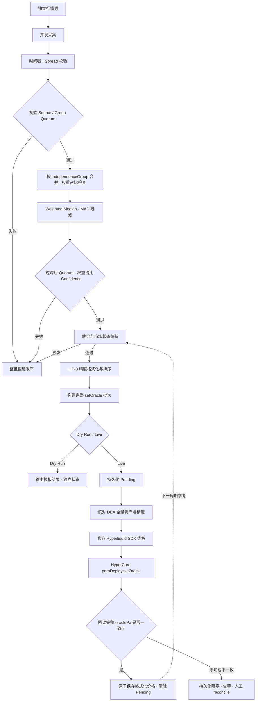

# HIP-3 Oracle

面向 Hyperliquid HIP-3 永续合约的多数据源预言机库。它把采集、异常过滤、聚合、风险控制与
`perpDeploy.setOracle` 发布拆开，并在任何 feed 不满足安全条件时拒绝整个批次。

0.2.0 提供可本地验证的运行底座：环境隔离、权重保护、发布回读确认、持久化待核对记录、监控、审计回放
和容器部署模板。真实行情配置中的供应商地址仍是占位符；尚未完成具体 DEX 的 Testnet 联调和主网验证。

## 已实现

- Static 与通用 JSON/REST 数据源适配器
- 数据源独立性分组，不把同源 API 误当作独立报价
- 时间戳、future/stale、bid/ask spread 检查
- Weighted Median、MAD 异常值过滤、IQR confidence
- 最小 source quorum 与最小独立 group quorum
- 异常过滤前后均检查单组权重占比，默认上限 40%，超限拒绝而不自动改权重
- 与上次已发布价格比较的跳价熔断
- Market Open/Closed/Unknown 策略
- HIP-3 价格精度与尾随零处理
- 全 feed 原子批次：缺少任何资产时不发送 `setOracle`
- 官方 `hyperliquid-python-sdk` 发布适配器
- Testnet/Mainnet 双重环境变量开关
- 网络、Dry-run/Live、DEX 隔离的价格状态；状态内也检查环境身份
- Live 发布前核对完整 DEX universe 和精度，发布后回读 `oraclePx`
- 写盘后再发送；结果未知时保留 pending，重启也不会自动重发
- 限次行情重试、单来源总超时、每供应商最小请求间隔
- 本地文件单写者锁、结构化 JSON 日志、健康检查、Prometheus 指标和告警模板
- 报价与决策 JSONL 审计及无网络的确定性回放
- Docker / Compose 模板、单元与故障测试、真实 SDK 离线签名兼容性测试

## 数据流



Hyperliquid 官方要求 `setOracle` 的 tuple 列表按 key 排序，两次调用至少相隔 2.5 秒，并建议正常情况下约每
3 秒更新。本库默认 `intervalMs=3000`，同时在发布器中增加本地 2.5 秒限速。

- [HIP-3 deployer actions](https://hyperliquid.gitbook.io/hyperliquid-docs/for-developers/api/hip-3-deployer-actions)
- [HIP-3 overview and oracle responsibility](https://hyperliquid.gitbook.io/hyperliquid-docs/hyperliquid-improvement-proposals-hips/hip-3-builder-deployed-perpetuals)
- [Hyperliquid signing guidance](https://hyperliquid.gitbook.io/hyperliquid-docs/for-developers/api/signing)
- [Price precision rules](https://hyperliquid.gitbook.io/hyperliquid-docs/for-developers/api/tick-and-lot-size)

## 快速开始

要求 Python 3.11+、Linux 或 macOS（本地写锁使用 `fcntl`）。核心聚合与 dry-run 没有第三方运行时依赖。

```bash
python3 -m venv .venv
source .venv/bin/activate
python -m pip install -e .

hip3-oracle --config config/example.json validate
hip3-oracle --config config/example.json once
python -m unittest discover -s tests -v
```

示例配置使用四个静态报价，其中 `500.00` 会被 MAD 过滤。CLI 输出最终将发送的 HIP-3 action，但不会连接
Hyperliquid；状态中的 `mode=dry-run` 和 `status=simulated` 明确区分真实发布。完整 Action 位于输出的
`publisherResponse.action`。

不安装包也可以运行：

```bash
PYTHONPATH=src python3 -m hip3_oracle --config config/example.json once
```

## 配置真实数据源

将 [config/json-source.example.json](config/json-source.example.json) 中的对象放进主配置的 `sources`，再把
source 名加入对应 feed。URL 支持 `{symbol}` 与 `{coin}` 占位符；字段路径支持 `data.price` 或 JSON Pointer
(`/data/price`)。

```json
{
  "kind": "json",
  "independenceGroup": "licensed-provider-a",
  "url": "https://provider.example/quotes/{symbol}",
  "headers": { "Authorization": "Bearer ${PROVIDER_A_TOKEN}" },
  "pricePath": "data.mid",
  "timestampPath": "data.timestamp",
  "timestampUnit": "ms"
}
```

关键配置：

| 字段 | 作用 |
| --- | --- |
| `minSources` | 过滤后至少保留的报价数 |
| `minIndependentGroups` | 过滤后至少保留的独立底层数据组数 |
| `maxGroupWeightShareBps` | 单组最大权重占比，默认 `4000`（40%），必须严格低于 50% |
| `maxSourceAgeMs` | 报价最大年龄 |
| `maxSpreadBps` | bid/ask 最大允许价差 |
| `outlierMadMultiplier` | MAD 异常值带宽倍数 |
| `maxConfidenceBps` | 聚合报价最大不确定性 |
| `maxJumpBps` | 相对上次已发布价格的最大跳变 |
| `blockWhenMarketClosed` | 休市时是否阻止更新 |
| `markPriceSets` | `0` 不提供额外 mark 输入；`1` 用本批聚合价提供一组输入 |
| `sourceTimeoutMs` | 每来源总时间预算，包含排队、重试和限流等待 |
| `publishTimeoutMs` | 发布与回读的整体时间预算，以及单个 SDK/info 请求的超时上限 |
| `confirmationAttempts` | 最多回读次数，默认 3；只重试查询，不重发交易 |

不要仅因为 API 域名不同就设置不同 `independenceGroup`。如果多个 API 最终都来自同一交易所或同一供应商，
它们必须属于同一个 group。

权重建议先全部设为 `1`。同组权重取成员最大值；来源掉线或异常组被剔除后，重新计算剩余组的权重占比。
例如权重 `2/1/1/1` 初始占比 40% 可以通过，但失去一个低权重组后占比变为 50%，整批阻止发布。
3 个等权组占比为 33.33%，所以配置 33% 上限时至少需要 4 个组。

Live 配置禁止 Static 来源，并强制 `timestampPath`，避免把接收时间当成行情产生时间。JSON 来源只对
网络故障、HTTP 429、5xx 重试（`maxRetries=0..2`），不重试认证失败或损坏数据；默认不跟随 HTTP
重定向，避免认证 Header 被转发。`minRequestIntervalMs` 按供应商串行限速，多个 Feed 共享同一来源预算。
发送前再次检查聚合行情时效，防止预检和初始化耗时让报价过期。保留的来源市场状态存在 Unknown 或冲突时，
聚合市场状态为 Unknown；是否阻止发布由 Feed 的 `blockWhenMarketUnknown` 决定。

配置可以使用 `AAPL` 或 `demo:AAPL`，发送时统一为 `demo:AAPL`；行情 `symbols` 映射使用配置中的原始 coin。
Live 预检要求配置覆盖 DEX 的全部资产，并匹配链上 `szDecimals`。模板只支持标准 HIP-3 `setOracle`，
不支持 HIP-3* 的 star oracle action。

## Testnet 发布

真实发布只通过 Hyperliquid 官方 Python SDK 签名：

从 [config/testnet.example.json](config/testnet.example.json) 建立 `config/testnet.local.json`，替换真实 DEX、
全部合约、供应商 URL / 字段映射，并按供应商实际独立性设置 group。模板中的 `.example` 域名不可用于真实行情。
`config/*.local.json` 已被 Git 和 Docker 构建忽略。

```bash
python -m pip install -e '.[live]'
hip3-oracle --config config/testnet.local.json validate

# 只查询 info，建立跳价参考；此命令无需私钥。
hip3-oracle --config config/testnet.local.json bootstrap --reason 'initial Testnet oracle reference'

# 通过密钥管理器注入 HIP3_PRIVATE_KEY 与行情 Token；此处不填写真实密钥。
export HIP3_ENABLE_LIVE='YES'
hip3-oracle --config config/testnet.local.json once --live
hip3-oracle --config config/testnet.local.json run --live
```

运行进程使用的 updater wallet 必须已被 HIP-3 deployer 授予 `setOracle` 权限。密钥只从进程环境读取，不允许写入
JSON 配置。建议使用专用、最小权限 oracle updater，并将 deployer key 保持离线。

主网还必须显式设置：

```bash
export HIP3_ENABLE_MAINNET='YES'
```

这只是防误操作开关，不替代审批、HSM/KMS 或发布权限隔离。

官方 SDK 固定为 `0.24.0`，CI 在 Linux/Python 3.11 和 3.12 上执行真实 SDK 的离线签名测试。
网络名称决定官方 endpoint；不能通过 `apiUrl` 跨环境签名。

## Market closed 与 mark price

HIP-3 action 本身没有 `marketStatus` 字段。本库可以在内部识别市场状态，但具体策略必须按产品设计：

- `blockWhenMarketClosed=false`：允许休市报价继续参与，但时间戳等检查仍然生效；没有自动保存/刷新收盘行情的机制；
- `blockWhenMarketClosed=true`：拒绝发布，需要独立 deployer 运维流程调用 `haltTrading`；
- 对股票等 RWA，不应依赖“停止更新”作为休市保护，因为协议可能回退到本地 mark price。

默认 `markPriceSets=0`，避免把同一个聚合值伪装成多个独立 mark 输入。若有独立的 perp/index mark 数据管线，
应扩展 `build_payload`，分别提供最多两组真正独立的 mark 输入。

## 熔断恢复

`stateFile` 是基础文件名；实际路径自动添加网络、模式和 DEX。例如：

```text
state/oracle-state.testnet.dry-run.demo.json
state/oracle-state.testnet.live.demo.json
state/oracle-state.mainnet.live.demo.json
```

保存的是格式化后的已发送价格。v1 文件不自动导入 v2 的 Live 状态，旧文件保留原样；首次 Live 必须通过
`bootstrap` 从 DEX Oracle 建立参考。跳价超限会持续阻塞，bootstrap 拒绝覆盖已有价格。

Live 在请求之前持久化 Pending；API `ok` 加完整价格回读一致才提交状态。超时、未知响应、回读失败或磁盘
错误均阻塞后续发布。操作员确认待发布价格已生效时可以执行：

```bash
hip3-oracle --config config/testnet.local.json reconcile --reason 'investigated timeout and verified oracle values'
```

`reconcile` 只读 info，不签名，不发送 setOracle；只有全部待核对价格匹配才更新本地状态。
价格回读不是交易包含证明；重复同价更新无法仅凭 `oraclePx` 证明具体请求已落链。停止其他 writer 后再核对，
回读不一致时保留 Pending，按 [RUNBOOK.md](RUNBOOK.md) 调查，不自动清除。

## 监控、审计与部署

`run` 根据 `monitoring` 配置启动 HTTP 服务，默认绑定本机 `127.0.0.1:9108`：

- `/livez`：进程存活，熔断时仍返回 200。
- `/readyz`、`/healthz`：首次成功周期前、最近周期被阻止或成功记录过期时返回 503。
- `/metrics`：周期状态、耗时、最后成功时间、来源失败数与耗时、Quorum 和 Confidence。

Dry-run 的 ready 只代表模拟流程健康；指标 `hip3_oracle_live_mode=0` 明确标识模式。Prometheus 抓取和告警示例
位于 [deploy/](deploy/)。告警规则仍需要部署 Prometheus 并配置接收人，库自身不发送通知。

每个状态文件对应一个 `.audit.jsonl`，记录标准化报价、当时阈值、参考价、决策和发布阶段。日志每 10 MB 轮转，
保留 5 个备份；不是长期审计归档。文件不记录认证 Header、API Token 或私钥。

```bash
hip3-oracle replay --journal state/oracle-state.testnet.dry-run.demo.audit.jsonl
docker compose up --build
```

Compose 默认运行 Dry-run，使用非 root 容器和持久状态卷；模板使用 Linux host network。
本地文件锁仅保证同一状态路径一个 writer，多主机需要外部分布式锁与 fencing。
详见 [RUNBOOK.md](RUNBOOK.md) 的部署、故障排查与环境迁移说明。

详见 [SECURITY.md](SECURITY.md)。
